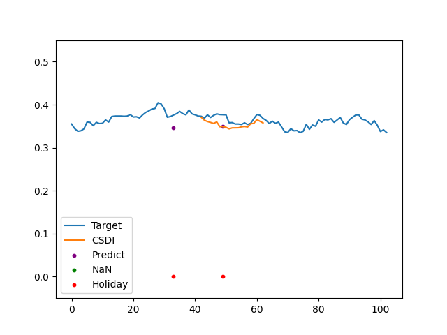
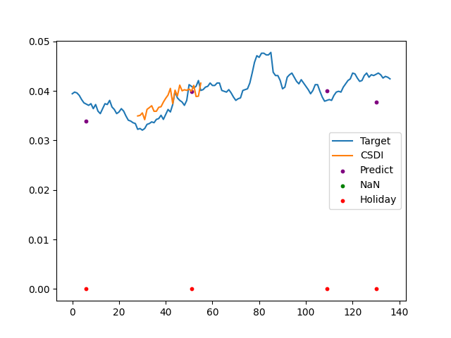
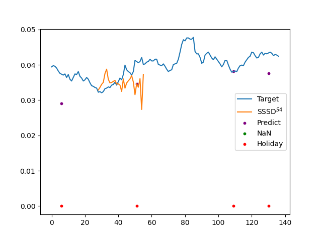
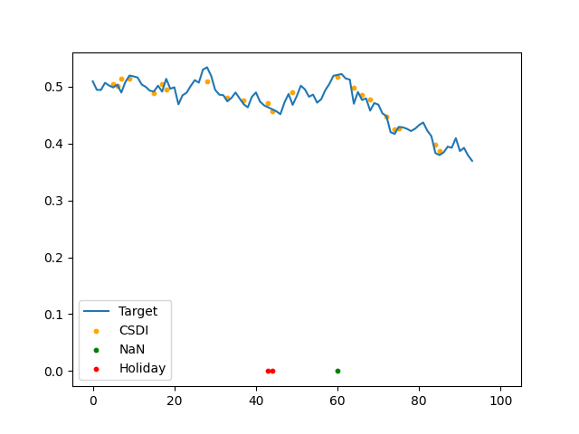
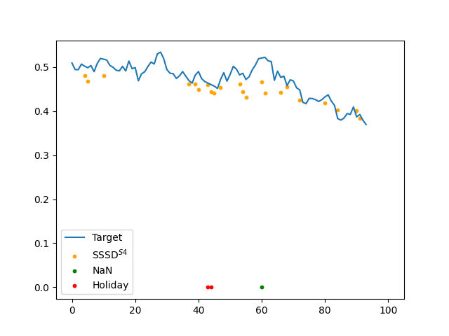

# MLCOE-Tensorflow-implementation
Tensorflow implementation of paper: Diffusion-based Time Series Imputation and Forecasting with Structured State Space Models (https://arxiv.org/abs/2208.09399).  
## Environment
● Ubuntu 20.04  
● NVIDIA RTX 3090
## Prerequisites
● Python 3.9.13  
● [Tensorflow](https://www.tensorflow.org/install) 2.11.0  
● cudatoolkit 11.2.2  
● cudnn 8.1.0 

## To do list
### Part 1 (Dec. 15, 2022)  
#### ●  Tensorflow implementation of SSSD<sup>S4</sup> (finished on Nov.19)&#x2705;.  
***1） Validate the tensorflow code on MuJoCo dataset with config_SSSDS4.json (90%RM), config_SSSDS4_mujoco_70.json(70%RM).***    
*Note: some limitations in the original PyTorch code*            
1.the training batch is fixed during the iteration (they didn't use PyTorch Dataset and Dataloader for random shuffle);     
2.the random misssing mask for different batchs is duplicated in the same iteration (not random enough);

Fast experiment - MuJoCo dataset 90% random missing
```
python train.py -c config/config_SSSDS4.json
python inference.py -c config/config_SSSDS4.json
```

*IMPUTATION MSE RESULTS (RM 90% + Iterations 150,000)* (reproduce MSE results in orginal paper)&#x2705;    
| Original paper | PyTorch code | Tensorflow code |
| :----:| :----: | :----: |
| 1.90(3)e-3 | [1.76e-3](figures/test_pytorch.png) | [1.67e-3](figures/test_tf.png) |      

*IMPUTATION MSE RESULTS (RM 70%)* (reproduce MSE results in orginal paper)&#x2705; 
| Original paper (Iterations 232,000) | Tensorflow code (Iterations 240,000)|
| :----:| :----: |
| 0.59(8)e-3 | [0.53e-3](figures/test_tf_24000_rm.png) |

***2) Train and test on stock dataset with random missing in length with all 6 features (finished on Dec.1).***   
*Stock data download and preprocess*  (updated on Dec. 27)             
1.take Hang_Seng for example (stock_data/data.py), download data with tickers, check valid trading days (over 10 years), save 10year stock.txt;     
2.iterate the weekdays from start to end, mask the trading days with holiday label:-1; nan label:0; valid label:1;     
3.normalize the raw data with min-max, scale to the [0,1] for each feature, and drop the batch with many nan data because of some new stocks have not been on the market in early days;    
4.split into the training dataset (0.8) and testing dataset (0.2).    

| Dataset (iteration, batch, length, feature)| Hang Seng | Dow Jones |  EuroStoxx |
| :----:| :----: | :----: |  :----: |
| training size | (73, 30, 103, 6) | (52, 40, 137, 6) | (55, 45, 94, 6) |    
| testing size| (6, 92, 103, 6) | (5, 104, 137, 6) | (6, 103, 94, 6) |        

*Note: some improvements in train_stock.py*         
1.implemented two masking methods, "blackout missing with length" and "random missing with length", applied on the valid mask with label 1 and set as missing mask with label 2;       
2.used different masks for each batch in the same iteration;       
3.added my_loss function, which counts nonzero numbers in the conditional mask (imputation noise), same as the original PyTorch version using index for valid imputation noise (z[loss_mask]). In the tensorflow verison of train.py, original mse loss directly counts all the mask numbers, although the value is zero for conditional noise (z*loss_mask), will not affect the model training.       


Fast experiment - Hang Seng dataset with "blackout missing with length"", k_segments=5
```
python train_stock.py -c config/config_SSSDS4_stock.json
python inference_stock.py -c config/config_SSSDS4_stock.json
```
Fast experiment - Hang Seng dataset with "random missing with length", k_misssing=21
```
python train_stock.py -c config/config_SSSDS4_stock_rm.json
python inference_stock.py -c config/config_SSSDS4_stock_rm.json
```

*Imputation results(averaged MAE, RMSE for 3 samples generated for each test sample, updated on Jan.5)*  
| Stock | Masking(RM or BM with length) | MAE(average)| RMSE(average)|
| :----: | :----:| :----: | :----: |
| Hang Seng | k_misssing = 21 | 0.0162 | 0.0249 |
| Hang Seng | k_segments = 5 | 0.0389 | 0.0607 |       
| Dow Jones | k_misssing = 28 | 0.0144 | 0.0250| 
| Dow Jones | k_segments = 5 | 0.0441 | 0.0866 | 
| EuroStoxx | k_misssing = 19 | 0.0274 | 0.0377| 
| EuroStoxx | k_segments = 5 | 0.0366 | 0.0597| 

***3) Validate on PTB-XL dataset (Jan.2).***      
Fast experiment - PTB-XL dataset under 20% MNR (comment line 103, uncomment line 104-107 in train.py/inference.py)
```
python train.py -c config/config_SSSDS4_ptbxl_mnr.json
python inference.py -c config/config_SSSDS4_ptbxl_mnr.json
```
*Imputation results using original PyTorch code and implemented Tensorflow code (one sample, one trial, updated on Jan.5)*  
| Results | Config | MAE | RMSE|  
| :----: | :----:| :----: | :----: | 
| Paper | 20% RM| 0.0034±4e-6 | 0.0119±1e-4 |     
| PyTorch |  [20% RM](figures_new/ptbxl_sssd/rm_inference_pytorch.out)   | 0.0046 | 0.0213| 
| Tensorflow | [20% RM](figures_new/ptbxl_sssd/rm_inference_tensorflow.out)  | 0.0048|  0.0196| 
| Paper  | 20% MNR| 0.0103±3e-3	 | 0.0226±9e-4 |
| PyTorch | [20% MNR](figures_new/ptbxl_sssd/mnr_inference_pytorch.out) | 0.0190 |0.0636 |
| Tensorflow |  [20% MNR](figures_new/ptbxl_sssd/mnr_inference_tensorflow.out) | 0.0202	| 0.077  |    
| Paper  | 20% BM|  0.0324±3e-3	| 0.0832±8e-3 | 
| PyTorch |  [20% BM](figures_new/ptbxl_sssd/bm_inference_pytorch.out)  | 0.0619| 0.164| 
| Tensorflow | [20% BM]  | 0.0608	| 0.162 |  

Fast experiment - generated 10 samples for each test sample, referenced from the CSDI code (updated on Jan. 5)  
```
python inference_nsamples.py -c config/config_SSSDS4_ptbxl_mnr.json
```
*Imputation results using the median value of 10 samples generated for each test sample (waiting 40 hours for imputation!!!)*  
| Results | Config | MAE | RMSE| CRPS |
| :----: | :----:| :----: | :----: | :----: | 
| Paper | 20% RM| 0.0034±4e-6 | 0.0119±1e-4 | 0.0282±1e-3 | 
| PyTorch |  20% RM   | | | |
| Tensorflow | 20% RM  | |  |   |
| Paper | 20% MNR| 0.0103±3e-3| 0.0226±9e-4 | 0.0787±3e-3 |  
| PyTorch |  20% MNR   | | | |
| Tensorflow | 20% MNR  | |  |   |
| Paper | 20% BM|  0.0324±3e-3| 0.0832±8e-3 | 0.2689±3e-3 |   
| PyTorch |  20% BM   | | | |
| Tensorflow | 20% BM  | |  |   |

#### ● Tensorflow implementation of CSDI   (finished code on Nov.26)
*Bug: the training loss didn't decrease. (solved on Dec.21, correct the mistake for tensor shape not changing after the transformer encoder layer)*&#x2705;              

***1) 20% RM, MNR, BM on PTB-XL (CSDI) (updated on Dec.13)***     
*Note: cannot reproduce the results using original PyTorch code with same training config.(**dataset with wrong tensor shape was used at that time**)*         
1.data length: should be 1000 or 250? For PTB-XL 1000 dataset, **considered L = 250 time steps** is mentioned in the paper. However, the table in the original paper shows training batch 4 with sample length 1000. Using this dataset config, **NVIDIA RTX3090 24GB out of memory** , which should be same for NVIDIA A30 cards with 24GB memory that author used. For training config, sample length is set to 250, batch size is set to 32.       
2.confusing masking config: In CSDI PyTorch code modified by SSSD authors, the code for **RM, MNR, BM** initialization in dataset are added, but the masks will not change in training. Also I found the RM code is not same as the RM definition in SSSD paper and SSSD code. However, the original code for **random strategy** (missing ratios [0%, 100%]) or **historical strategy** in CSDI paper is still maintained in the CSDI model, which will change the mask during the training. I have tried the two combination of the training settings in original code, the results are shown in the Table.

*Imputation results using orignal CSDI PyTorch code and masking settings (**previous wrong results using the dataset with wrong tensor shape**)*  
| Results | Config | MAE | RMSE|  CRPS |
| :----: | :----:| :----: | :----: |  :----: |
| Paper | 20% RM| 0.0038±2e-6 | 0.0189±5e-5 | 0.0265±6e-6 |    
| PyTorch |  [20% RM + Random strategy](figures/rm_0.2.png)| 0.0102 | 0.0514 | 0.0698| 
| PyTorch |  [0% RM + fixed 20% Random strategy](figures/fixed_0.2_RS.png)| 0.0114 | 0.0351| 0.0783 |      
                          
3.I reimplemented the **RM, MNR, BM** in the CSDI training module referenced from the masking code in the SSSD, the results are shown in [1],[2],[3]. For CSDI evaluate code, I noticed that it used the median value of 10 samples generated for each test sample to calculate mae and rmse, while only the averaged value mentioned in the SSSD paper. Need to finish all experiment to figure out which one is more close to the paper results.      
4.For implemented Tensorflow code, the training config is same as the modified PyTorch version. The **RM, MNR, BM** masking can be changed by commenting/uncommenting in line 570-572(val), 577-579(train), 588-590(evaluate) in imputers/CSDI.py. The same masking should be applied for train, val and evaluation. Note that the previous masking function code by SSSD and CSDI authors are preserved, but will not be used in the model training. The results are shown in the Table.    
5.I made a stupid mistake when I reshape the data length 1000 using (250, 4) instead of (4, 250). All the CSDI results before Jan. 2 are wrong because the tensor shape of training dataset are wrong. I have to redo all the ptbxl related experiments. I found the mistake when I draw the imputation figures. And I also found that the results based on the median value of 10 samples generated for each sample are close to the paper results.(updated on Jan. 5).     

Fast experiment - 20% BM on PTB-XL
```
python train_csdi.py
```

*Imputation results using CSDI PyTorch code and implemented Tensorflow code with the same modified masking (**using the dataset with correct tensor shape**)*  
| Results | Config | MAE | RMSE|  CRPS |
| :----: | :----:| :----: | :----: |  :----: |
| Paper | 20% RM| 0.0038±2e-6 | 0.0189±5e-5 | 0.0265±6e-6 |    
| PyTorch [1]|  [20% RM implemented] |  | |  | 
| Tensorflow | [20% RM implemented](figures_new/ptbxl_csdi/rm_tensorflow.out) | 0.0034| 0.0115 |  0.0234|      
| Paper  | 20% MNR| 0.0186±1e-5 | 0.0435±2e-4 | 0.1306±5e-5 | 
| PyTorch [2] | [20% MNR implemented]|  | |  | 
| Tensorflow | [20% MNR implemented](figures_new/ptbxl_csdi/mnr_tensorflow.out) |0.0114  | 0.0555 | 0.0772 |    
| Paper  | 20% BM| 0.1054±4e-5 | 0.2254±7e-5 | 0.7468±2e-4 |   
| PyTorch [3]| [20% BM implemented](figures_new/ptbxl_csdi/bm_pytorch.out) |0.0627 | 0.1742 | 0.4229 |    
| Tensorflow | [20% BM implemented](figures_new/ptbxl_csdi/bm_tensorflow.out) |0.0649| 0.1787 |0.4477|   

***2) Train and test on stock dataset (updated on Dec.24)***    
*Note: some improvements in imputers/CSDI_stock.py compared to the imputers/CSDI.py*         
1.write a clear version based on *imputers/CSDI.py*, and deleted all useless functions and config code.       
2.implemented two masking methods for the stock data, including "random missing with length" and "blackout missing with length", which can be changed through the config by the target_strategy setting instead of the comment/uncomment by hand in the previous *imputers/CSDI.py*. The masking code is same in train_stock.py (SSSD<sup>S4</sup>) for fair comparison.

Fast experiment - Hang Seng dataset with "random missing with length", k_misssing = 21; "blackout missing with length", k_segments = 5;
```
python train_csdi_stock.py
```

*Imputation results (updated on Dec.27)*  
| Stock | Masking(RM or BM with length) | MAE(average/median)| RMSE(average/median)|
| :----: | :----:| :----: | :----: |
| Hang Seng | k_misssing = 21 | 0.0079(0.0071) | 0.0170(0.0160) |
| Hang Seng | k_segments = 5 | 0.0226(0.0205) | 0.0379(0.0344) |       
| Dow Jones | k_misssing = 28 | 0.0058(0.0052) | 0.0169(0.0150)| 
| Dow Jones | k_segments = 5 | 0.0139(0.0128) | 0.0283(0.0260) | 
| EuroStoxx | k_misssing = 19 | 0.0092(0.008) | 0.0247(0.0213)| 
| EuroStoxx | k_segments = 5 | 0.0225(0.0204) | 0.0390(0.0353)| 

**Figure: 20% BM on Hang Seng**

     
**Figure: 20% BM on Dow Jones**

    
**Figure: 20% RM on EuroStoxx**

     
### Part 2 Bonus question  (have no time, decide not to do)
● Bonus question 1       
● Bonus question 2 


## Acknowledgments 
Code is based on PyTorch implementation of the original paper (https://github.com/AI4HealthUOL/SSSD).
